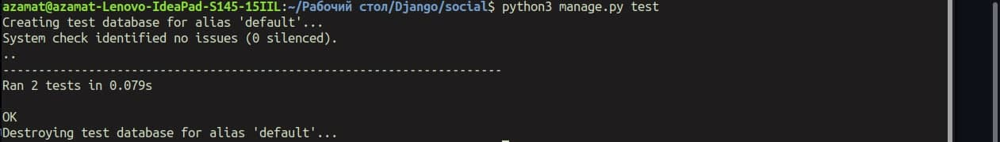
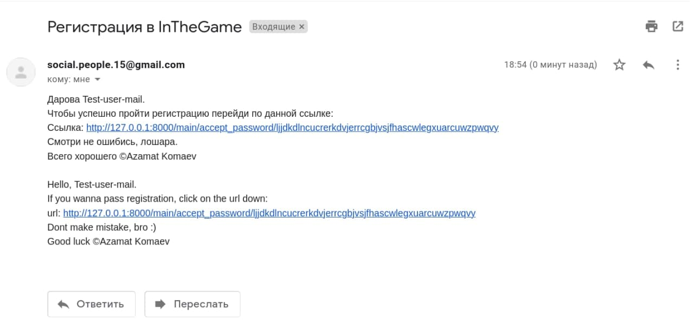
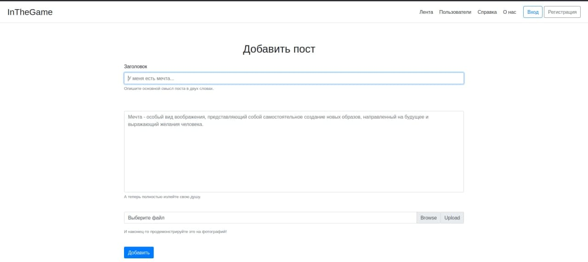
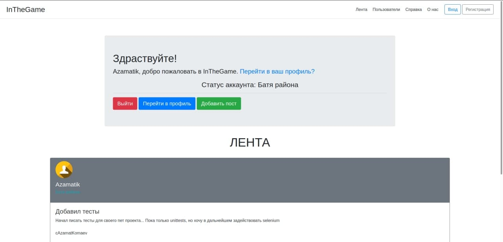
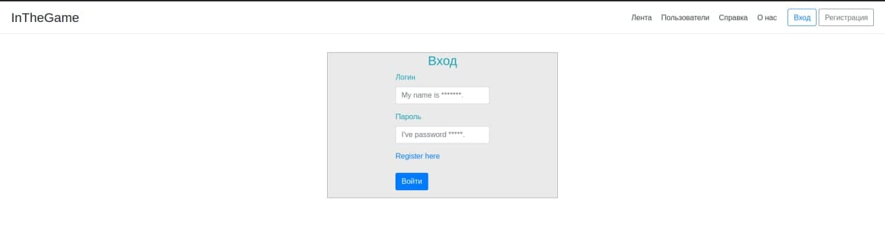
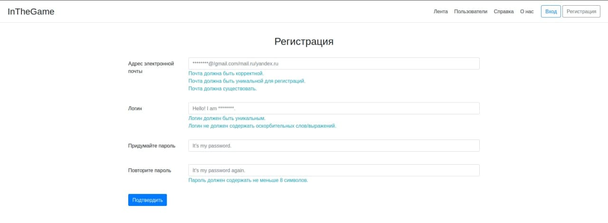
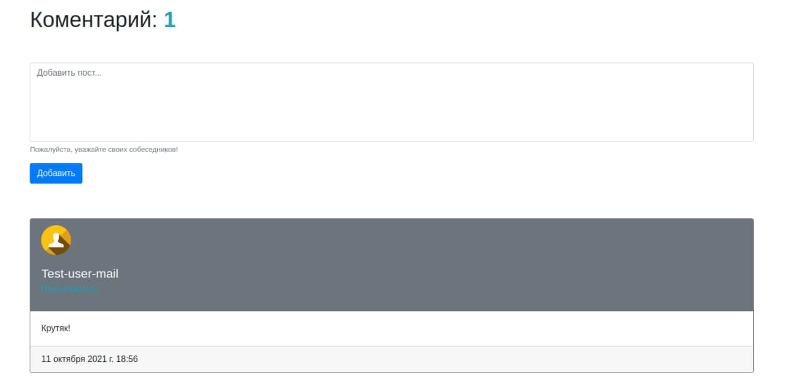
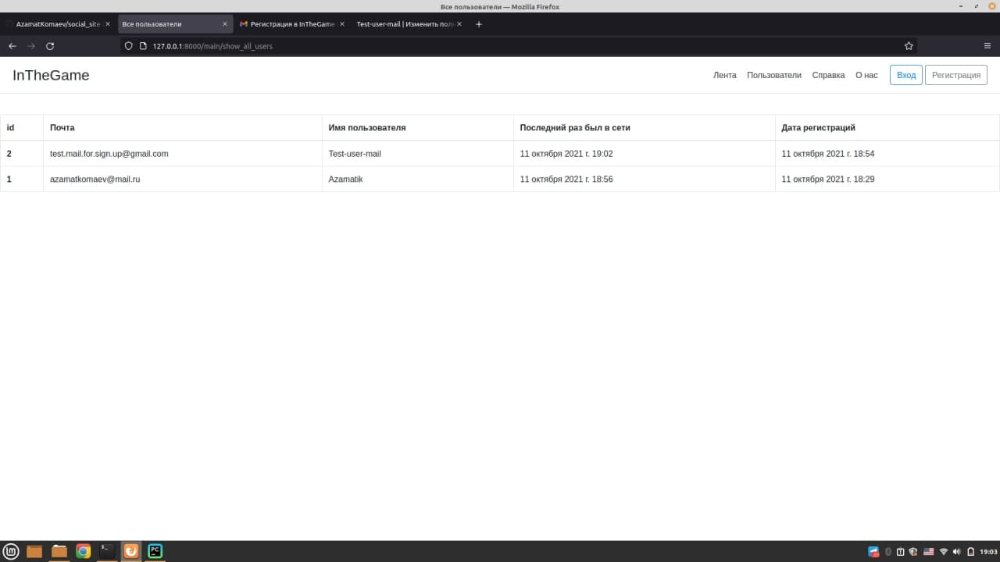

<h1>InTheGame</h1>

  Всем привет. Это мой первый проект на Django. Тут я использую также bootstrap4. Пишу сайт около 2-3 месяцев.

 
<h2>Что из себя представляет сайт?</h2>

  1. Данный сайт является мини соц.сетью уже с готовой системой входа и регистраций, создания постов и комментариев, обработка ошибок итд. Любые замечания по проекту буду только рад услышать.  
  2. Сайт имеет логику удаления непотвержденных пользователей, которые не подтвердили свой аккаунт по почте при помощи crontab'a. Не забудьте добавить задачу для файла 'soc/cron.py', при этом желательно указать время исполнения файла каждые 1-3 часа.  
  3. Сайт использует базу данных по умолчанию: sqlite3. Я не стал заносить её в git-репзиторий, поэтому, чтобы создать базу данных, пропишите в командной строке следующее:  
  <b>python manage.py migrate</b>  
  4. Также присутствуют unit тесты (пока на стадий разработки и изучения). Чтобы ими воспользоваться используйте команду  
   
  <b>python manage.py test</b>  
  5. Не забудьте добавить настройку SMPT для подтверждения аккаунтов и восстановление паролей на сайте.  
   

<h2>Внешний вид</h2>

  А вот сама вертска:  
  
  
  
  
  
  
  
  

